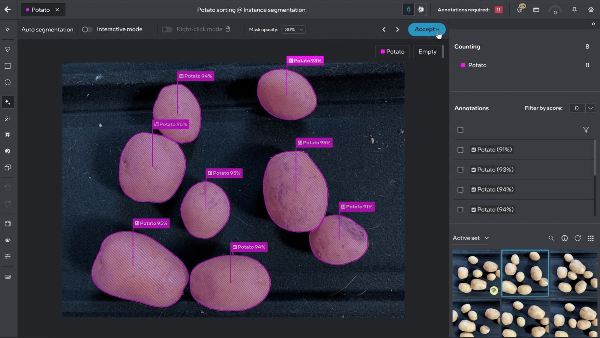

<!---
Copyright (C) 2022-2025 Intel Corporation
LIMITED EDGE SOFTWARE DISTRIBUTION LICENSE
-->

  

    
  

 

[Key Features](#key-features) | [User Guide](https://docs.geti.intel.com/docs/user-guide/getting-started/introduction) | [Dev Guide](https://docs.geti.intel.com/docs/developer-guide) | [License](LICENSE)

 

## 👋 Introduction

Intel® Geti™ enables anyone to build computer vision AI models in a fraction of the time and with minimal data. The software provides you with a seamless, end-to-end workflow to prepare state-of-the-art computer vision models in minutes.

 

### Key features

🏋️‍♂️ Interactive Model Training 

Intel® Geti™ enables users to start building computer vision models with as few as 10-20 images and iterate on those models with the help of domain experts. The algorithm selects samples from the dataset that help the model learn quickly and achieve high accuracy while reducing the sample biases and the number of data inputs required from the human expert (Active learning).

🧠 Smart Annotations 

Smart annotations in Intel® Geti™ enable users to easily create bounding boxes, rotated bounding boxes, segmentation boundaries, and more. These smart annotation features coupled with the AI-assisted annotations and state-of-the-art AI models such as the Segment Anything Model keep human experts in the loop while massively reducing the total annotation efforts needed by a human.

🤖 Visual Prompting 

With Intel® Geti™ Visual Prompting workflow, users can prompt a model with only a single annotation. Utilizing <a target="_blank" rel="noopener noreferrer" href="https://arxiv.org/abs/2304.02643">the Segment Anything Model from Meta AI</a>, the Visual Prompting workflow further accelerates the time-to-model for our users by providing state-of-the-art innovation.

🎨 Multiple Computer Vision Tasks 

Intel® Geti™ supports <a target="_blank" rel="noopener noreferrer" href="https://docs.geti.intel.com/docs/user-guide/learn-geti/computer-vision-tasks/ai-fundamentals-tasks">multiple computer vision tasks</a> that are commonly employed across various use cases: object detection, rotated object detection, classification, segmentation, anomaly-based tasks.

⛓️ Task Chaining 

<a target="_blank" rel="noopener noreferrer" href="https://docs.geti.intel.com/docs/user-guide/learn-geti/computer-vision-tasks/task-chaining-project">Chaining multiple tasks</a> (such as detection and classification) enables Intel® Geti™ users to develop a more granular model and collaborate more effectively across teams. This way users can decouple sequential models to break down complex tasks into smaller, more manageable tasks and simultaneously create multiple, specialized models rather than forcing a single model to learn every aspect of the task at hand.

🎯 Model Evaluation 

Intel® Geti™ provides users with comprehensive statistics to assess model’s performance and run live tests. Intel® Geti™ executes model testing to evaluate the model performance on unseen data to ensure that the model is fit for purpose for the real-life deployment setup.

🚀 Production-Ready Models 

Intel® Geti™ outputs optimized deep learning model for the OpenVINO™ toolkit to run on Intel® architecture CPUs, GPUs and VPUs or models in PyTorch* format.

## 🧮 Supported models

Intel® Geti™ supports several neural network architectures, each tailored to specific computer vision tasks. The table below provides an overview of the supported tasks, types, and corresponding model architectures.

### Supported deep learning models

| Computer Vision Task | Feature | Model Architectures Supported |
| -------------------------| ---- | ----------------------------- |
| Image Classification | Single label  Multi-label  Hierarchical | [Mobilenet-V3](https://arxiv.org/abs/1905.02244)  [EfficientNet-B0](https://arxiv.org/abs/1905.11946)  [DeitTiny](https://arxiv.org/abs/2012.12877) |
| Object Detection | Counting  Rotated Object Detection  | [ATSS with ResNet](https://arxiv.org/abs/1912.02424) or [MobilenetV2](https://arxiv.org/abs/1912.02424)  [SSD with MobilenetV2](https://arxiv.org/abs/1512.02325) [RT-DETR](https://arxiv.org/abs/2304.08069) [YOLOX](https://arxiv.org/abs/2107.08430) [D-Fine](https://arxiv.org/abs/2410.13842) |
| Image Segmentation | Instance Segmentation  Semantic Segmentation | [MaskRCNN with EfficientNet](https://arxiv.org/abs/1703.06870)  [ResNet50](https://arxiv.org/abs/1512.03385)  [Swin Transformer](https://arxiv.org/abs/2103.14030) [RTMDet](https://arxiv.org/abs/2212.07784)  [Lite-HRNet](https://arxiv.org/abs/2104.06403)  [SegNext](https://arxiv.org/abs/2209.08575)  [DinoV2](https://arxiv.org/abs/2304.07193)|
| Anomaly-based Tasks | Anomaly classification  Anomaly detection  Anomaly segmentation | [Padim](https://arxiv.org/abs/2011.08785)  [STFPM](https://arxiv.org/abs/2103.04257)  [UFlow](https://arxiv.org/abs/2211.12353) |

## 🛫 Getting Started

Intel® Geti™ can be deployed either on a local machine, on-premises, or on a virtual machine. Intel® Geti™ software uses Kubernetes to orchestrate various component services. The client front end uses HTTP protocol to connect to the platform, so users can access the software through a web browser.

Intel® Geti™ can be installed:

- [Using the Intel® Geti™ Installer](https://docs.geti.intel.com/docs/user-guide/getting-started/installation/using-geti-installer)
- [Using Helm Charts](https://docs.geti.intel.com/docs/user-guide/getting-started/installation/using-helm-charts)
- [Advanced Installation](https://docs.geti.intel.com/docs/user-guide/getting-started/installation/advanced-installation)

## 🏗️ High-level architecture

Intel® Geti™ is a cloud-native distributed system architecture comprising interactive microservice and AI workflows. Most components of Intel® Geti™ adhere to the microservice architecture style, while some components, such as active learning, follow the service-based architecture style. Additionally, event-driven architecture is utilized for asynchronous communication between components.
The core subsystems of Intel® Geti™ are:

- **Platform Services and K8S deployment**: provides basic services (identity and access management, logging and observability), serves as an abstraction layer over the infrastructure services.
- **Workflows & Interactive Microservices**: enables seamless workflows from dataset management to model training, optimization, evaluation, and deployment.
- **Intel® Geti™ Deep Learning Frameworks**: implement modern ML development stack to support computer vision datasets management, training, evaluation, optimization and deployment ML models, end-to-end inference API, Visual explanation for OpenVINO models and anomaly detection library.

  
  

Please see the details in [Intel® Geti™ documentation](https://docs.geti.intel.com/docs/developer-guide).

## 🪐 Ecosystem

- [Anomalib](https://github.com/open-edge-platform/anomalib) - An anomaly detection library comprising state-of-the-art algorithms and features such as experiment management, hyper-parameter optimization, and edge inference.
- [Datumaro](https://github.com/open-edge-platform/datumaro) - Dataset Management Framework, a Python library and a CLI tool to build, analyze and manage Computer Vision datasets.
- [OpenVINO™ Training Extensions](https://github.com/open-edge-platform/training_extensions) - Train, Evaluate, Optimize, Deploy Computer Vision Models via OpenVINO™
- [Intel® Geti™ SDK](https://github.com/open-edge-platform/geti-sdk) - Software Development Kit (SDK) for the Intel® Geti™.
- [OpenVINO™](https://github.com/openvinotoolkit/openvino) - Software toolkit for optimizing and deploying deep learning models.
- [OpenVINO™ Model Server](https://github.com/openvinotoolkit/model_server) - A scalable inference server for models optimized with OpenVINO™.
- [OpenVINO™ Model API](https://github.com/open-edge-platform/model_api) - A set of wrapper classes for particular tasks and model architectures, simplifying data preprocess and postprocess as well as routine procedures.
- [OpenVINO™ Test Drive](https://github.com/openvinotoolkit/openvino_testdrive) - With OpenVINO Test Drive, users can run large language models (LLMs) and models trained by Intel® Geti™ on their devices, including AI PCs and Edge devices.
- [OpenVINO™ Explainable AI Toolkit](https://github.com/openvinotoolkit/openvino_xai) - Visual Explanation for OpenVINO™ Models.

## 📢 Who uses Intel® Geti™?

Intel® Geti™ is a powerful tool to build vision models for a wide range of processes, including detecting defective parts in a production line, reducing downtime on the factory floor, automating inventory management, or other automation projects. We have chosen to highlight a few interesting community members:

- [Royal Brompton and Harefield hospitals](https://www.rbht.nhs.uk/artificial-intelligence-theme-new-trust-led-research)
- [WSC Sports](https://www.linkedin.com/posts/wsc-sports-technologies_revolutionizing-sports-broadcasting-with-activity-7161419649878773761-cUM3/)
- [Dell NativeEdge](https://infohub.delltechnologies.com/en-us/p/transforming-edge-ai-with-continuous-learning-meet-intel-geti-and-openvino-on-dell-nativeedge/)
- [Bravent](https://www.linkedin.com/posts/bravent_intelgeti-openvino-manufacturing-activity-7214544905086390272-H19g/)
- [ASRock Industrial](https://www.asrockind.com/en-gb/article/176)

## 🎡 Community

- To report a bug, file a documentation issue, or submit a feature request, please open a [GitHub issue](https://github.com/open-edge-platform/geti/issues).
- Ask questions via [GitHub Discussions](https://github.com/open-edge-platform/geti/discussions).

## 🙌 Contributing

We welcome contributions! Check out our [Contributing Guide](CONTRIBUTING) to get started.

  <b>Thank you 👏 to all our contributors!</b>

    

## 📝 License

Intel® Geti™ repository is licensed under [LIMITED EDGE SOFTWARE DISTRIBUTION LICENSE](LICENSE).

Models fine-tuned by Intel® Geti™ are licensed under [Apache License Version 2.0](https://opensource.org/licenses/Apache-2.0).

FFmpeg is an open source project licensed under LGPL and GPL. See https://www.ffmpeg.org/legal.html. You are solely responsible for determining if your use of FFmpeg requires any additional licenses. Intel is not responsible for obtaining any such licenses, nor liable for any licensing fees due, in connection with your use of FFmpeg.

---

\* Other names and brands may be claimed as the property of others.
