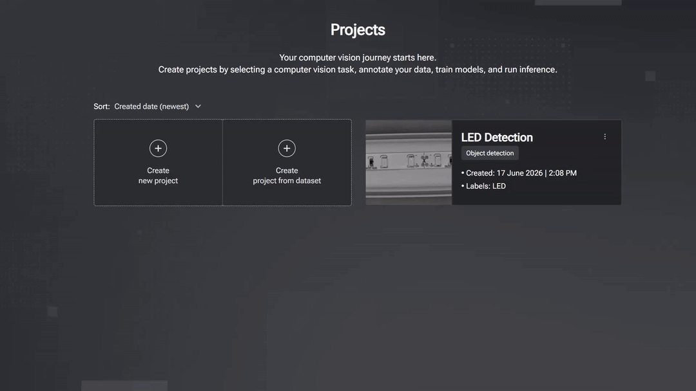

<!-- markdownlint-disable MD013 MD033 MD041 MD042 -->

<div align="center">


**Full-stack web application to build and deploy computer vision AI models, powered by the [getitune](../library) library.**

[]()
[]()
[]()

[Application](#geti-application) •
[Docs](#documentation) •
[License](#license)

</div>

## Geti Application

Geti is an end-to-end application for building and deploying computer vision AI models.
It provides an intuitive graphical interface to upload image or video data, annotate datasets,
train and optimize models, and run real-time inference through configurable pipelines.

<p align="center">
  
</p>

Main capabilities:

- **Detection, segmentation, and classification**: train object detection and instance segmentation models such as RF-DETR, DINOv3 DETR, EdgeCrafter (ECDet), YOLO, and Mask R-CNN, alongside image classification models. Explore the [model catalog](../README.md#key-features) for task-specific options.
- **No-code model lifecycle**: move from data upload and annotation to training, evaluation, and deployment in one UI.
- **Built-in data and annotation workflows**: manage datasets, labels, and revisions with manual and AI-assisted annotation tools.
- **Pipeline-based deployment**: connect sources (cameras or files) to trained models and route predictions to sinks such as storage, MQTT, or webhooks.
- **Intel hardware acceleration**: fine-tune on Intel® CPUs and GPUs, then deploy supported models through OpenVINO™ for inference on Intel® CPUs, GPUs, and NPUs, including Intel® Core™ Ultra platforms (Panther Lake) and Intel® Arc™ B-series GPUs. Model and device compatibility follows [OpenVINO™ device support](https://docs.openvino.ai/2026/documentation/compatibility-and-support/supported-devices.html).

### Installation

Geti can be installed as a **Windows app**, run as a **Docker container**, built **from source**, or set up with the
**install script**. Pick the option that best fits your environment.

For complete, step-by-step instructions - including prerequisites, GPU/accelerator support, TLS and TURN configuration,
air-gapped setup, and troubleshooting - see the [Installation guide](./docs/install.md).

## Documentation

Please check the [documentation website](https://docs.geti.intel.com/) for detailed guides, API reference,
and other resources to help you get the most out of Geti.

> **Upgrading an existing installation?** See the [Upgrade guide](./docs/upgrade.md) for how to move to a newer
> version (Docker or Windows MSIX) while preserving your projects, datasets and models, with automatic rollback
> if a migration fails.

<details>
<summary><strong>Advanced: generate the API spec from source </strong></summary>

The OpenAPI specification for the Geti REST API can be generated with the `generate-api-spec` command:

```bash
# From the repo root
cd application/backend

# Generate the OpenAPI spec and save it to a custom location
just gen-api-spec --output-path="openapi.json"
```

</details>

## License

The Geti source code is licensed under the [Apache 2.0 License](https://www.apache.org/licenses/LICENSE-2.0). The Windows MSIX App is licensed under the [Intel Simplified Software License](https://software.intel.com/sites/landingpage/pintool/intel-simplified-software-license.txt).
For more information, refer to the [LICENSE](../LICENSE) page.
