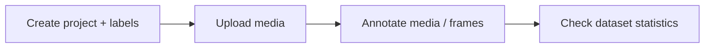

# Geti Application: Annotating & Managing Labels

Set up the labeled data that training needs: create a **project** bound to a
task type, curate its **labels**, upload **media**, and attach **annotations**
to media items and video frames — all through the Geti REST API. This skill is
about _using_ the API, not changing backend code (use `geti-backend-dev` for
that).

These endpoints are served by a **running Geti instance**; how it was launched
does not matter (Docker container, Windows MSIX app, install script, or
`just run-server` from `application/backend/` for development). Ask the user for
their base URL rather than assuming one — `https://localhost:7860` is only the
default for a local deployment, the port is configurable and remote instances
use a different host. See `application/docs/install.md` for the deployment
modes. The authoritative API reference is the spec the instance serves; fetch it
as JSON from `/api/openapi.json` (the `/api/docs` page is only an HTML viewer
for humans). Read endpoint paths and payloads from there rather than from any
checked-in Markdown, which may be out of date. If no instance is running and you
have the sources, generate the spec with `just gen-api-spec --output-path
openapi.json` from `application/backend/`.
Task/label background is `application/docs/labels.md`.

## When to Use

- User wants to create a project and define its initial labels.
- User needs to add, rename/recolor, or remove labels on an existing project.
- User wants to upload images/videos and annotate them.
- User needs to set classification labels, bounding boxes, or polygons on media
  or specific video frames.
- User wants to check whether a dataset is annotated enough to train.

## Key concepts

- **Task type is fixed per project.** A project addresses one task
  (classification, detection, instance segmentation); it cannot change after
  creation. Supported annotation shapes follow the task type.
- **Labels belong to the project.** Labels have an immutable UUID plus editable
  attributes (name, color, hotkey). They cannot be reparented to another
  project. `exclusive_labels` marks whether labels are mutually exclusive
  (e.g. multiclass classification).
- **Annotations attach to dataset items.** For videos, annotations target a
  specific `frame_index`.

## Create and configure a project

1. **Create a project** with a task type and initial labels.
   - `POST /api/projects` with `name`, `task.task_type`
     (`classification` / `detection` / `instance_segmentation`),
     `task.exclusive_labels`, and `task.labels[]`.
   - Done when: `GET /api/projects/<id>` returns the project with its labels.
2. **Manage labels** on an existing project.
   - `PATCH /api/projects/<id>/labels` with `labels_to_add[]`,
     `labels_to_edit[]`, `labels_to_remove[]`.
   - Done when: `GET /api/projects/<id>` reflects the updated label set.

## Upload media

- **Upload** an image or video: `POST /api/projects/<id>/dataset/media`
  (binary). This creates the corresponding dataset item.
- **List** media (paginated, filterable): `GET /api/projects/<id>/dataset/media`
  with query params like `limit`, `offset`, `annotation_status`, `labels[]`,
  `subsets[]`, `sort_by`, `sort_direction`.
- **Fetch** a media file or thumbnail:
  `GET /api/projects/<id>/dataset/media/<media_id>/binary` and `/thumbnail`.
- **Delete** media: `DELETE .../media/<media_id>` or bulk delete with
  `DELETE .../media` and `media_ids[]`.

## Annotate media

- **Set / update annotations** on a media item:
  `POST /api/projects/<id>/dataset/media/<media_id>/annotations` with
  `annotations[]` (shapes + labels), optional `subset` (train/val/test), and
  `frame_index` for videos.
- **Get annotations**: `GET .../annotations` (pass `frame_index` for videos).
- **Delete annotations**: `DELETE .../annotations` (pass `frame_index` for
  videos).
- **Video frames**: list annotated frames with
  `GET .../media/<media_id>/frames` using `frame_index_from` /
  `frame_index_to`.

Match shapes to the project task type:

| Task type             | Annotation shape         |
| --------------------- | ------------------------ |
| Classification        | image-level label(s)     |
| Detection             | bounding box + label     |
| Instance segmentation | polygon + label          |

## Verify the dataset is trainable

- **Dataset items**: `GET /api/projects/<id>/dataset/items` (filter by
  `annotation_status`, `labels[]`, `subsets[]`).
- **Statistics**: `GET /api/projects/<id>/dataset/statistics` for media and
  annotation counts.
- Done when: at least 3 annotated items exist in your dataset, although
  annotating several more is recommended for better results — then launch a
  `train` job (see `geti-using-the-pipeline`).

## Notes

- To bring in an already-annotated dataset instead of annotating from scratch,
  use `geti-import-export-datasets`.
- The API spec at `/api/openapi.json` is the only authoritative source for
  endpoint paths and payloads. To add or change endpoints, use
  `geti-backend-dev` and `geti-openapi-sync`.

## Related skills

- `geti-import-export-datasets` — import an existing annotated dataset instead
  of manual annotation.
- `geti-using-the-pipeline` — the end-to-end project → train → deploy workflow.
- `geti-backend-dev` — change the project/label/media/annotation endpoints.
