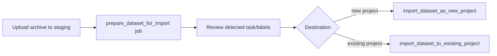

# Geti Application: Import & Export Datasets

Move datasets in and out of the Geti application through its REST API. This is
the practical "migration to Geti" path: bring existing annotated data from Geti,
CVAT, Label Studio, or any tool that emits a standard dataset archive, or export
a project's data for backup or reuse in other frameworks. This skill is about
_using_ the API, not changing backend code (use `geti-backend-dev` for that).

These endpoints are served by a **running Geti instance**; how it was launched
does not matter (Docker container, Windows MSIX app, install script, or
`just run-server` from `application/backend/` for development). Ask the user for
their base URL rather than assuming one — `https://localhost:7860` is only the
default for a local deployment, the port is configurable and remote instances
use a different host. See `application/docs/install.md` for the deployment
modes. The authoritative API reference is the spec the instance serves; fetch it
as JSON from `/api/openapi.json` (the `/api/docs` page is only an HTML viewer
for humans). Read endpoint paths and payloads from there rather than from any
checked-in Markdown, which may be out of date. If no instance is running and you
have the sources, generate the spec with `just gen-api-spec --output-path
openapi.json` from `application/backend/`.
Design background is `application/docs/dataset-ie.md`.

## When to Use

- User has an existing dataset archive and wants to import it into Geti.
- User wants to migrate annotated data from another tool into a Geti project.
- User needs to export a project's dataset or a dataset revision for backup or
  external use.
- User needs to remap labels or filter subsets/labels while transferring data.

## Key concepts

- **Standard archives.** Uploaded and downloaded datasets are zip archives in a
  standard format (Datumaro, COCO, YOLO, Pascal VOC).
- **Staging area.** Import/export flows through a filesystem staging area
  (`data/staged_datasets/`). Each staged dataset has a UUID. You can upload via
  the API or drop an archive directly into the staging folder for large files.
- **Everything long-running is a job.** Prepare, import, export, and stage all
  run as async jobs via `POST /api/jobs`; poll or stream their status.
- **Task compatibility.** Importing into an existing project may transform
  annotations to match the project task type; unsupported conversions fail the
  import (see `application/docs/dataset-ie.md`).

## Import a dataset

1. **Upload the archive to staging.**
   - `POST /api/staged_datasets` (zip file) → staged dataset id.
   - Alternatively drop the archive directly into `data/staged_datasets/` for
     large or unreliable uploads.
   - Done when: `GET /api/staged_datasets` lists the entry.
2. **Prepare the dataset for import.**
   - `POST /api/jobs` with job type `prepare_dataset_for_import`
     (`staged_dataset_id`) → job id. This extracts, converts to Datumaro, and
     detects task type, labels, and item/annotation counts.
   - Done when: `GET /api/staged_datasets/<id>` reports `ready_for_import` with
     detected metadata.
3. **Review detected metadata** (task type, labels, counts) to configure the
   import — especially label remapping for an existing project.
4. **Import to a destination** via `POST /api/jobs`:
   - New project: `import_dataset_as_new_project` (`staged_dataset_id`,
     `project.name`, `project.task_type`, optional `filters`).
   - Existing project: `import_dataset_to_existing_project` (`staged_dataset_id`,
     `project_id`, `labels_mapping`, `include_unannotated`).
   - Done when: the job finishes and the target project's dataset lists the new
     items (`GET /api/projects/<id>/dataset/items`).

## Export a dataset

1. **Submit an export job.**
   - `POST /api/jobs` with job type `export_dataset` (`project_id`, optional
     `dataset_id`/revision, `export_format` such as COCO/YOLO/VOC, optional
     `filters` for labels/subsets/unannotated) → job id.
   - Done when: the job finishes and a staged dataset with `ready_for_export`
     appears.
2. **Download the archive.**
   - `GET /api/staged_datasets/<id>/zip`, or take it directly from
     `data/staged_datasets/<id>/`.

## Filtering & label remapping

- **Filtering** (labels, subsets, include/exclude unannotated) can be applied at
  stage/export time or at import time. Apply at stage time to reuse the same
  filtered dataset across multiple imports; apply at import time for
  per-import flexibility.
- **Label remapping** (`labels_mapping`) aligns source labels to a destination
  project's label set when importing into an existing project.

## Tracking the jobs

All operations return a job id from `POST /api/jobs` (HTTP 202). Poll
`GET /api/jobs/<id>`, or stream `GET /api/jobs/<id>/status` and
`GET /api/jobs/<id>/logs` (SSE) until a terminal state (`DONE`, `FAILED`,
`CANCELLED`); cancel with `POST /api/jobs/<id>:cancel`.

## Cleanup

- Delete a staged dataset when done: `DELETE /api/staged_datasets/<id>`.
- Staged datasets locked by a running job cannot be deleted; the system may also
  auto-clean old staged datasets.

## Notes

- The REST snippets in `application/docs/dataset-ie.md` are design-level and may
  lag behind the implementation; the API spec at `/api/openapi.json` is the only
  authoritative contract.
- Importing a *dataset* is supported; importing an externally trained *model*
  (BYOM) is not — pipeline models come only from in-project training/quantization.

## Related skills

- `geti-annotating-and-managing-labels` — set up projects/labels and annotate
  media before or after import.
- `geti-using-the-pipeline` — the end-to-end project → train → deploy workflow.
- `geti-backend-dev` — change the import/export endpoints or job implementations.
